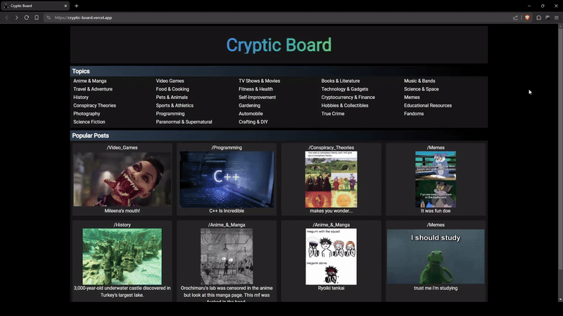

<br>
<div align="center">
    <a href="https://github.com/varun2430/cryptic_board/commits/main/"></a>
    <a href="https://github.com/varun2430/cryptic_board/issues"></a>
    <a href="https://github.com/varun2430/cryptic_board/blob/main/LICENSE"></a>
    <a href="https://www.linkedin.com/in/varun-kadkade-7359aa214/"></a>
</div>
<br>

<br />
<div align="center">
  <a href="https://github.com/varun2430/cryptic_board">
    
  </a>

  <h3 align="center">CrypticBoard</h3>

  <p align="center">
    Anonymous Image Board
    <br />
    <br />
    <a href="https://drive.google.com/file/d/1W_2U8WxNKvveyDiwBcloxkguUYNCo4-Q/view?usp=sharing">View Demo</a>
    ·
    <a href="https://github.com/varun2430/cryptic_board/issues/new?labels=bug">Report Bug</a>
    ·
    <a href="https://github.com/varun2430/cryptic_board/issues/new?labels=enhancement">Request Feature</a>
  </p>
</div>

## About The Project

<div align="center">
    
</div>

CrypticBoard is a completely anonymous platform for individuals to discuss sensitive topics through images and text, providing a safe space for free expression and connection.

### Built With

The following are the list of frameworks/libraries used in this project.

<div align="center">
    
    
    
    
</div>

## Getting Started

This is a guide on how to set up the project locally. Follow these steps to get a local copy up and running.

### Prerequisites

Ensure you have the following installed:

- [Node.js LTS](https://nodejs.org/)

### Installation

1. Clone the repository:

   ```sh
   git clone https://github.com/varun2430/cryptic_board.git
   ```

2. Setup the Backend:

   ```sh
   cd backend
   npm install
   ```

   Create a .env file in the backend directory and set the required environment variables:

   ```sh
   PORT=""
   AWS_REGION=""
   AWS_ACCESS_KEY=""
   AWS_SECRET_KEY=""
   S3_BUCKET=""
   MONGO_URL=""
   API_KEY=""
   ```

   Start the Express server:

   ```sh
   node server.js
   ```

3. Setup the Frontend:
   ```sh
   cd frontend
   npm install
   ```
   Create a .env file in the frontend directory and set the required environment variables:
   ```sh
   VITE_API_URL = ""
   VITE_API_KEY = ""
   ```
   Start the development server:
   ```sh
   npm run dev
   ```

## Contributing

If you have a suggestion that would make this better, please fork the repo and create a pull request. You can also simply open an issue with the tag "enhancement".
Don't forget to give the project a star! Thanks again!

1. Fork the Project
2. Create your Feature Branch (`git checkout -b feature/AmazingFeature`)
3. Commit your Changes (`git commit -m 'Add some AmazingFeature'`)
4. Push to the Branch (`git push origin feature/AmazingFeature`)
5. Open a Pull Request

## License

Distributed under the GPL-3.0 License. See `LICENSE` for more information.
